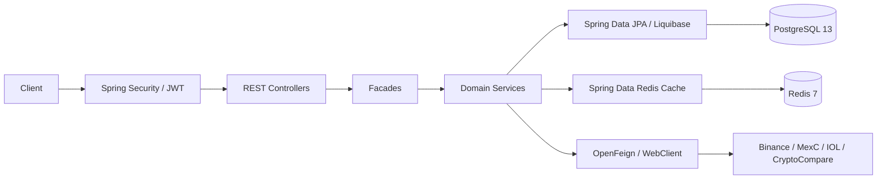

# InvestTracker

Cryptocurrency portfolio tracker and accounting engine calculating cost basis (AVCO), realized/unrealized P&L, and multi-exchange historical sync.

## Prerequisites

| Component | Requirement |
|---|---|
| Java | JDK 11+ (runtime compatible with JDK 17/21; `sourceCompatibility = 11`) |
| Build Tool | Gradle Wrapper (`./gradlew`) |
| Database | PostgreSQL 13+ with schema `file_importer_schema` (default port `5435`) |
| Cache | Redis 7+ (default port `6379`) |
| Containers | Docker & Docker Compose |

## Getting Started

```bash
# 1. Start backing services (PostgreSQL & Redis)
docker compose -f docker/docker-compose.yml up -d

# 2. Build application
./gradlew build

# 3. Run unit tests
./gradlew test

# 4. Run integration tests (requires Docker for Testcontainers)
./gradlew integrationTest

# 5. Start application (runs on http://localhost:9080)
./gradlew bootRun
```

Interactive API documentation: [Swagger UI](http://localhost:9080/swagger-ui.html) | [OpenAPI JSON](http://localhost:9080/api-docs).

## Configuration

### Profiles & Contexts

- **Spring Profiles**: `default` (`application.yml`), `dev` (`appli-dev.yml` with debug SQL logging).
- **Liquibase Contexts**: `development`, `production`.

### Environment Variables

| Variable | Default (Local Dev) | Description |
|---|---|---|
| `SERVER_PORT` | `9080` | HTTP application port |
| `DB_URL` | `jdbc:postgresql://localhost:5435/importer_database?currentSchema=file_importer_schema,public` | PostgreSQL JDBC connection URL |
| `DB_USERNAME` | `root` | Database username |
| `DB_PASSWORD` | `password` | Database password |
| `SPRING_DATA_REDIS_HOST` | `localhost` | Redis server host |
| `SPRING_DATA_REDIS_PORT` | `6379` | Redis server port |
| `CRYPTOCOMPARE_API_KEY` | *(Configured in `application.yml`)* | CryptoCompare API key for pricing |
| `JWT_SECRET` | *(Configured in `application.yml`)* | HMAC-SHA256 secret key for JWT authentication |
| `JWT_EXPIRATION` | `86400000` (24h) | JWT expiration time in milliseconds |

## Architecture Context

Built on Spring Boot 2.7.15:
- **Security**: Spring Security with stateless JWT filter chain (`JwtAuthenticationFilter`).
- **Persistence**: Spring Data JPA with Hibernate Spatial (PostGIS dialect) and automated Liquibase schema migrations.
- **Caching**: Spring Data Redis backing immutable historical price lookups (`HistoricalPriceCacheService`).
- **External Integration**: Spring Cloud OpenFeign (IOL client) and Spring WebFlux `WebClient` (Binance & MexC HMAC-SHA256 APIs).
- **Testing**: Spock Framework 2.0 (Groovy 3.0) and Testcontainers for PostgreSQL integration specs.



## Documentation Index

- [Architecture & Standards](docs/architecture.md) — Layered architecture, conventions, and request flows.
- [Exchange Integrations](docs/exchange-integrations.md) — Binance, MexC, and IOL sync guides and endpoints.
- [Accounting Scenarios](docs/accounting-scenarios.md) — Financial specification for AVCO, fees, and P&L.
- [Authentication Guide](docs/authentication.md) — JWT auth endpoints and test credentials.
- [Testing & Coverage](docs/testing.md) — Spock test commands, JaCoCo targets, and coverage gaps.
- [Deployment Guide](docs/deploy-guide.md) — Docker containerization and production configuration.
- [API Documentation Guide](docs/api-documentation-guide.md) — SpringDoc OpenAPI annotation standards.
- [Development Roadmap](docs/roadmap.md) — Active technical debt and upcoming milestones.
