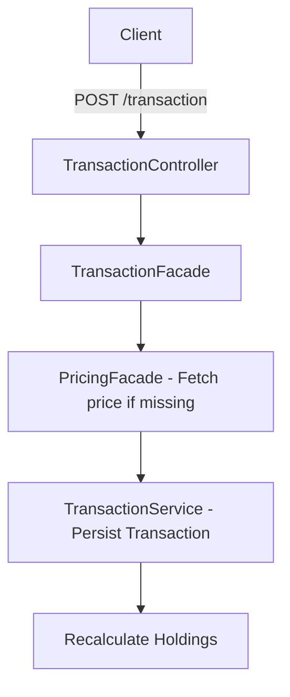

# Architecture & Engineering Standards

System architecture, layered design, execution flows, and engineering standards.

## Layered Architecture

```
Controller → Facade → Service → Repository → Entity (JPA)
```

| Layer | Responsibility | Key Standards |
|---|---|---|
| **Controller** | HTTP routing, request validation, OpenAPI metadata | SpringDoc annotations (`@Tag`, `@Operation`, `@ApiResponse`). |
| **Facade** | Multi-service orchestration and DTO transformation | No domain business logic. |
| **Service** | Core business logic, accounting rules, exchange sync | Pure domain logic. `BigDecimal` arithmetic only. |
| **Repository** | Data access layer | Spring Data JPA interfaces. |
| **Entity** | Relational mapping | JPA entities mapped to `file_importer_schema`. |

## Core Spring Modules

- **Spring Boot 2.7.15**: Core application runtime on port `9080`.
- **Spring Security**: Stateless JWT bearer filter chain (`JwtAuthenticationFilter`).
- **Spring Data JPA & Hibernate Spatial**: PostgreSQL persistence with PostGIS dialect.
- **Liquibase**: Relational schema migrations (`db.changelog-master.xml`).
- **Spring Data Redis**: High-performance persistent key-value cache for immutable historical prices.
- **Spring Cloud OpenFeign & Spring WebFlux**: Declarative REST (`IolClient`) and reactive HMAC-signed clients (`BinanceApiService`, `MexcApiService`).
- **Spring WebSocket**: STOMP messaging (`/ws`) for asynchronous full sync progress updates.

## Engineering Standards

- **Runtime Target**: JDK 11+ (runtime compatible with JDK 17/21; `sourceCompatibility = '11'`).
- **Financial Precision**: All calculations use `BigDecimal` with minimum 8 decimal places for crypto amounts, 10 for intermediate values, and `RoundingMode.HALF_UP`.
- **Dependency Injection**: Use Lombok `@RequiredArgsConstructor` constructor injection.
- **Extensibility**: Adapter factories (`TransactionAdapterFactory`, `ProcessFileFactory`) for ingestion formats.

## Request Execution Flows

### Ingestion Flow (File Upload)

```mermaid
graph TD
    Client -->|POST /transaction/upload/{portfolio}| Controller[TransactionController]
    Controller --> Factory{ProcessFileFactory}
    Factory --> Engine[ProcessFileV2]
    Engine --> Parser[FileImporterService]
    Parser --> AdapterFactory[TransactionAdapterFactory]
    AdapterFactory --> Adapter[Exchange Adapter]
    Adapter --> Persistence[TransactionService / DB]
    Persistence --> HoldingCalc[CoinInformationService]
    HoldingCalc --> Response[FileInformationResponse]
```

### Manual Transaction Flow



## Core API Routing

Interactive documentation: [Swagger UI](http://localhost:9080/swagger-ui.html).

| Domain | Base Route | Key Endpoints | Controller |
|---|---|---|---|
| **Transactions** | `/transaction` | `GET /filter`, `POST /`, `DELETE /{id}`, `POST /upload/{portfolio}`, `POST /information/all/{portfolio}` | [`TransactionController`](../src/main/java/com/importer/fileimporter/controller/TransactionController.java) |
| **Holdings** | `/holding` | `GET /`, `POST /add`, `POST /addMultiple` | [`HoldingController`](../src/main/java/com/importer/fileimporter/controller/HoldingController.java) |
| **Portfolios** | `/portfolio` | `GET /`, `GET /names`, `POST /distribution`, `GET /download` | [`PortfolioController`](../src/main/java/com/importer/fileimporter/controller/PortfolioController.java) |
| **Exchange Config** | `/api/exchange` | `POST /config`, `GET /config` | [`ExchangeConfigController`](../src/main/java/com/importer/fileimporter/controller/ExchangeConfigController.java) |

## Accounting Rules

- **Cost Basis (AVCO)**: Weighted average cost. Buys accumulate `inventoryCostUsdt`; sells decrease cost basis proportionally (`avgCost = inventoryCostUsdt / oldAmount`).
- **Realized P&L**: Calculated on SELL: `proceedsUsdt - proportionalCostBasis`.
- **Unrealized P&L**: Mark-to-market position: `currentValueUsdt - inventoryCostUsdt`.
- **Stablecoin Anchors** (`OperationUtils.STABLE`): `USDT`, `DAI`, `BUSD`, `USD`, `USDC`, `TUSD`, `FDUSD` (fixed 1:1 USD valuation). `UST`/`USTC` is strictly non-stable.
